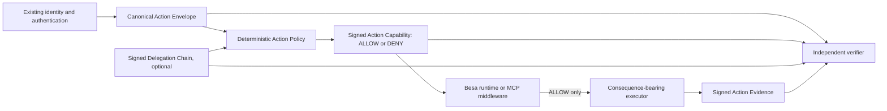

# Besa Architecture

Besa is a cryptographic admission and evidence primitive for consequential
machine actions. It consumes identity and authorization context from an
existing system; it is not an IAM provider, tool router, payment rail, or
execution sandbox.

## Components

| Component | Responsibility | Does not do |
|---|---|---|
| Action Envelope v1 | Canonically describes one requested action, its constraints, expiry, nonce, and request hash. | Authenticate the caller or execute a tool. |
| Action Policy v1 | Deterministically returns `allow` or `deny` for exact action fields. | Run a policy DSL, fetch remote data, or make LLM decisions. |
| Delegation v1 | Proves a narrowed authority path from a trusted root to an agent. | Create identities or broaden authority. |
| Action Capability v1 | Binds an action hash and decision to an issuer signature. | Claim that the action executed. |
| `withBesa` / `withBesaMcp` | Rejects invalid, denied, expired, or replayed actions before calling the supplied handler and records evidence afterward. | Replace application authentication or transport security. |
| Action Evidence v1 | Links an allowed action, capability, supplied result, optional legacy receipt, and recorder signature. | Independently observe real-world side effects. |
| Hosted Verifier | Exposes bounded HTTP verification and optional token-protected action admission. | Operate a public Besa cloud, retain evidence, or manage customer identities. |

## Trust boundaries

The principal, agent, decision authority, executor, evidence recorder, key
authority, and verifier can be separate systems. Strong deployments do not
give the executor the admission-signing key. A verifier trusts configured
public keys; cryptographic validity alone never establishes trust.

An `ActionEvidenceV1` proves that its recorder signed the supplied result and
that the supplied action and capability link correctly. It does not prove that
an external payment, deletion, deployment, or other side effect happened
unless the recorder is independently trusted to observe that event.

## Deployment modes

### Local

The application runs the SDK beside the executor. This is easy to adopt but
the application operator controls both admission and execution.

### Customer-controlled gateway

A customer runs `besa serve` or uses the SDK immediately in front of a
privileged tool. The customer supplies TLS termination, ingress policy,
secrets, key custody, and a durable replay store when one-time use matters.

### Independently controlled admission service

A separately controlled service signs capabilities and verifies evidence. This
can separate the decision key from the executor, but it adds network,
availability, key-management, and operational responsibilities. Besa v1.1
ships the self-hosted implementation, not a Besa-operated public service.

## Protocol invariants

- Every new artifact has an explicit version, strict schema, canonical JSON,
  domain-separated Ed25519 signature or hash, and deterministic reason codes.
- Unknown security-sensitive fields are rejected.
- A capability binds the exact action hash, principal, agent, operation,
  resource, constraints hash, nonce, and expiry. A capability for one resource
  cannot authorize another.
- A child delegation must be a subset of its parent across identity, operation,
  resource, scopes, constraints, and time window.
- Replay is only prevented when an enforced replay store consumes the action
  hash and nonce before execution. Stateless verification detects no global
  reuse by itself.
- Existing v1.0 signed manifests, receipts, rotations, and attestations remain
  unchanged and independently verifiable.
