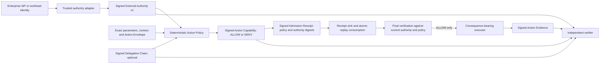

# Besa Architecture

Besa is a cryptographic admission and evidence primitive for consequential
machine actions. It consumes identity and authorization context from an
existing system; it is not an IAM provider, tool router, payment rail, or
execution sandbox.

BESA decides whether a protected agent action may execute and produces
portable evidence of that decision. It does not merely detect malicious
behavior after execution.

BESA does not replace enterprise identity or authorization systems.
It consumes verifiable authority and binds that authority to an exact
pre-execution decision, producing portable cryptographic evidence.

```mermaid
flowchart LR
  I[Enterprise IdP or workload identity] --> N[Trusted authority adapter]
  N --> A[Signed External Authority v1]
  Q[Exact parameters, context and Action Envelope] --> P[Deterministic Action Policy]
  A --> P
  D[Signed Delegation Chain, optional] --> P
  P --> C[Signed Action Capability: ALLOW or DENY]
  C --> S[Signed Admission Receipt: policy and authority digests]
  S --> L[Receipt sink and atomic replay consumption]
  L --> R[Final verification against current authority and policy]
  R -->|ALLOW only| X[Consequence-bearing executor]
  X --> E[Signed Action Evidence]
  A --> V[Independent verifier]
  C --> V
  D --> V
  E --> V
```

## Components

| Component | Responsibility | Does not do |
|---|---|---|
| Action Envelope v1 | Canonically describes one requested action, its constraints, expiry, nonce, and request hash. | Authenticate the caller or execute a tool. |
| Action Policy v1 | Deterministically returns `allow` or `deny` for exact action fields. | Run a policy DSL, fetch remote data, or make LLM decisions. |
| Delegation v1 | Proves a narrowed authority path from a trusted root to an agent. | Create identities or broaden authority. |
| External Authority v1 | A trusted normalizer signs safe upstream claims, exact grants, issuer, audience, validity, assertion digest, and optional delegation digest. | Validate OAuth/JWKS, exchange an ID-JAG, or confer authority from identity alone. |
| Pre-execution Request / Admission Receipt v1 | Binds the exact action, parameters, context, policy digest/version, authority/assertion digest, identities, nonce, decision, and validity. | Prove execution or stateless one-time use. |
| Action Capability v1 | Binds an action hash and decision to an issuer signature. | Claim that the action executed. |
| `withBesa` / `withBesaMcp` | Rejects invalid, denied, expired, or replayed actions before calling the supplied handler and records evidence afterward. | Replace application authentication or transport security. |
| `withPreExecutionAdmission` | Requires the new receipt, verifies authority and policy, awaits receipt storage, enforces replay consumption, rechecks immediately before invoking the executor, and links result evidence to the receipt. | Route tools, expose a new identity service, or accept a legacy capability as a substitute. |
| `withBesaExecutor` | Independently enforces a supplied admission receipt, host-authenticated caller and signed context executor ID at the protected callback. | Trust a caller's `validated` flag, authenticate transport or sandbox another credential path. |
| `FileReplayStore` | Atomically persists a spent action/nonce claim across processes on one trusted local filesystem, with explicit durability modes. | Coordinate independent hosts, replay results, automatically retry or guarantee exactly-once external effects. |
| Action Evidence v1 | Links an allowed action, capability, supplied result, optional legacy receipt, and recorder signature. | Independently observe real-world side effects. |
| Hosted Verifier | Exposes bounded HTTP verification and optional token-protected action admission. | Operate a public Besa cloud, retain evidence, or manage customer identities. |

## Trust boundaries

The principal, agent, decision authority, executor, evidence recorder, key
authority, and verifier can be separate systems. Strong deployments do not
give the executor the admission-signing key. A verifier trusts configured
public keys; cryptographic validity alone never establishes trust.

The authority adapter is a separate trust boundary. Its pinned Ed25519 key
attests that the upstream assertion was verified and safely normalized. The
receipt binds its digest; offline verification proves the normalizer's signed
claims, not the original IdP signature or current upstream revocation state.
An independent IdP check additionally requires the original assertion through
a secure channel and that provider's verifier. Bearer credentials are absent
from the authority and receipt schemas.

The executor separately receives caller identity from its host's authenticated
context. The supplied receipt is not proof that its presenter is that caller.
The request context binds the target executor ID; the guarded callback consumes
the detached request only after independent verification and committed replay.
The content-addressed artifact publisher is one real filesystem integration,
not an external adoption claim or a generic execution gateway.

An `ActionEvidenceV1` proves that its recorder signed the supplied result and
that the supplied action and capability link correctly. It does not prove that
an external payment, deletion, deployment, or other side effect happened
unless the recorder is independently trusted to observe that event.

## Deployment modes

### Local

The application runs the SDK beside the executor. This is easy to adopt but
the application operator controls both admission and execution.

### Customer-controlled gateway

A customer runs `besa serve` or uses the SDK immediately in front of a
privileged tool. The customer supplies TLS termination, ingress policy,
secrets, key custody, and a durable replay store when one-time use matters.

### Independently controlled admission service

A separately controlled service signs capabilities and verifies evidence. This
can separate the decision key from the executor, but it adds network,
availability, key-management, and operational responsibilities. Besa v1.1
ships the self-hosted implementation, not a Besa-operated public service.

## Protocol invariants

- Every new artifact has an explicit version, strict schema, canonical JSON,
  domain-separated Ed25519 signature or hash, and deterministic reason codes.
- Unknown security-sensitive fields are rejected.
- A capability binds the exact action hash, principal, agent, operation,
  resource, constraints hash, nonce, and expiry. A capability for one resource
  cannot authorize another.
- A child delegation must be a subset of its parent across identity, operation,
  resource, scopes, constraints, and time window.
- Replay is only prevented when an enforced replay store consumes the action
  hash and nonce before execution. Stateless verification detects no global
  reuse by itself.
- Existing v1.0 signed manifests, receipts, rotations, and attestations remain
  unchanged and independently verifiable.
- Protected executors using the new wrapper cannot be invoked until a valid
  ALLOW receipt exists, its append completes, and replay consumption succeeds.
  DENY receipts are appended without invoking the executor. Schema-invalid or
  non-canonical requests are rejected without manufacturing signed evidence.
- The executor receives a detached, deeply frozen intent. MCP and HTTP
  reference wrappers also snapshot actual call data before asynchronous work.
- Authority and policy are checked again after asynchronous operations.
  Downstream resource state, alternate credential paths, semantics within a
  handler, and exactly-once delivery remain the host application's responsibility.
- Persistence remains outside the deterministic cryptographic core.
  FileReplayStore never removes an uncertain/expired claim. Strict file/directory
  fsync support is required by default; Windows process mode is an explicit
  weaker choice. Durable receipt-sink completion is a deployment contract, not
  something an arbitrary append interface can prove.
- Legacy artifacts retain their domains and bytes. The stronger wrapper
  accepts only the new admission schema; legacy verification is not a fallback
  authorization path. See [migration](docs/RUNTIME_ADMISSION.md#migration).

## Runtime enforcement boundary

Besa is not a sandbox, credential broker, egress-policy engine, or general-purpose
agent runtime. Those controls belong to runtimes and enforcement systems.

Besa's boundary is cryptographic admission and portable execution evidence:
identity and delegation are bound to an exact requested action, a policy decision,
and independently verifiable signed evidence.

Runtime integrations should compose with Besa rather than move runtime-specific
enforcement into Besa core.

See [OpenShell boundary audit](docs/research/OPENSHELL_BOUNDARY_AUDIT.md).
