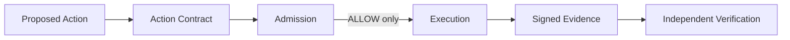
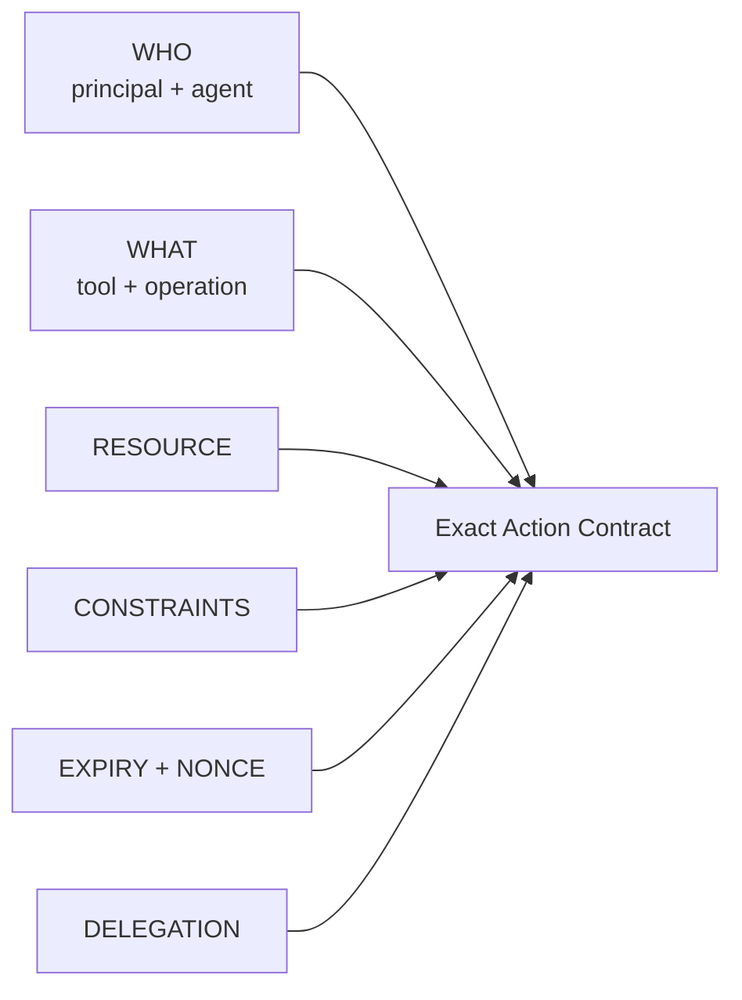

# Besa

**Cryptographic admission and evidence for consequential AI-agent actions.**

Identity tells you **who** the agent is. Besa answers whether **this exact
action** may execute, under which constraints, and leaves signed evidence of
the decision and supplied result.

[](https://github.com/dorigjo/besa/actions/workflows/ci.yml)
[](https://www.npmjs.com/package/@dorigjo/besa)

```text
Agent
  |
IAM / OAuth / MCP Auth        Who may reach the system?
  |
  v
Besa                          May this exact action execute?
  |
  v
Consequential action          Deploy, delete, transfer, privileged tool call
  |
  v
Cryptographic evidence        What was admitted and what result was supplied?
```

An agent has valid AWS credentials. Its signed action contract permits
`DEPLOY` to `staging`. It asks to `DELETE production-db`.

```text
AWS identity and access:  ACCEPTED
Besa exact-action check:  DENY ACTION_NOT_GRANTED
Executor called:          no
```

AWS IAM remains responsible for identity and cloud access. Besa sits at the
last application-controlled boundary before execution and verifies the signed,
exact-action authorization.

## Try Besa in 60 seconds

```bash
npm install @dorigjo/besa
npx besa demo
```

The command runs a real local deny/allow path:

```text
AUTHENTICATED != AUTHORIZED FOR THIS EXACT ACTION

ACTION
agent: agent:deploy-agent
operation: delete
resource: database:production-db
authorized contract: deploy commit abc123 to environment:staging

RESULT
DENY
ACTION_NOT_GRANTED
executor called: no

ACTION
agent: agent:deploy-agent
operation: deploy
resource: environment:staging

RESULT
ALLOW
ACTION_ALLOWED
executor called: yes
signed capability: cap_<uuid>
action hash: <sha256>
evidence verification: EVIDENCE_VALID
```

The demo generates Ed25519 keys in memory, signs and verifies the exact-action
capability, blocks the denied handler, executes the allowed mock handler, and
verifies the linked evidence. It does not contact AWS or mutate infrastructure.

## Why authentication is not enough

Authentication can establish that an agent reached a service. Broad cloud or
MCP permissions can establish that it may call a tool. Neither proves:

```text
May this agent deploy commit abc123 from repository dorigjo/besa
to production, with risk <= 20, before this expiry, exactly once?
```

Besa represents that question as a canonical Action Envelope. A deterministic
policy produces a signed Action Capability bound to the action hash, resource,
constraints, expiry, and nonce. The runtime verifies it immediately before the
handler and records signed evidence afterward.

## Why a separate protocol

A cloud provider, identity vendor, MCP gateway, or customer can implement the
same control. Besa provides a provider-neutral artifact contract that can cross
identity systems, agent frameworks, tools, and execution rails. Frozen formats,
public conformance vectors, and keyless verification let another party verify
the decision without depending on the executor's private log format.

That value depends on correct integration and real adoption. v1.1 is an
unaudited open-source implementation and conformance surface, not an industry
standard, certification, or claim that vendor-native controls are insufficient
for every deployment. Besa uses ESM modules and requires Node.js 20 or later.

## The v1.1 protocol

| Artifact | Purpose |
|---|---|
| `ActionEnvelopeV1` | Canonical proposed action: principal, agent, tool, operation, resource, request hash, scopes, constraints, expiry, nonce, and risk. |
| `DelegationV1` | Signed, narrowing authority from a trusted root to an agent. A child cannot broaden its parent. |
| `ActionCapabilityV1` | Signed allow or deny bound to the exact action and policy decision. |
| `ActionEvidenceV1` | Signed link from action and allow capability to the supplied execution result. |



An exact action contract binds all security-relevant dimensions:



All artifacts use strict schemas, bounded canonical JSON, SHA-256 identities,
domain-separated Ed25519 signatures, and stable machine-readable reason codes.
See [SPEC.md](SPEC.md) and the immutable vectors in [conformance/](conformance/).

## Runtime integration

`withBesa` sits immediately before the consequence-bearing handler:

```ts
import {
  AppendOnlyEvidenceLog,
  InMemoryReplayStore,
  withBesa,
} from "@dorigjo/besa";

const execute = withBesa(
  {
    trustStore,
    capability: getCapabilityForExactAction,
    replayStore: new InMemoryReplayStore(),
    replayRequirement: "enforce",
    evidenceKeyPair: recorderKeyPair,
    evidenceSink: new AppendOnlyEvidenceLog("./evidence.jsonl"),
    recorderId: "recorder:production",
    executorId: "deployment:primary",
    requireDelegation: true,
    delegationChain,
  },
  async (action) => deployExactCommit(action.constraints),
);

const { result, capability, evidence } = await execute(actionEnvelope);
```

Before calling the handler, the wrapper validates the action, verifies issuer
trust and the exact capability, checks optional delegation, and consumes replay
state. A signed deny never executes. Success and handler failure both generate
signed evidence. See [Runtime Admission](docs/RUNTIME_ADMISSION.md).
See also [Agent Gateway Integration](docs/AGENT_GATEWAY.md) for deployment
boundaries and [Evidence Artifacts](docs/EVIDENCE_ENVELOPE.md) for independent
verification semantics.

`InMemoryReplayStore` enforces one-time use only inside one process. Use a
customer-owned atomic `ReplayStore` for durable or distributed replay
protection. Besa fails closed when `replayRequirement: "enforce"` cannot be met.

Copy-paste reference boundaries:

- [Generic TypeScript tool wrapper](examples/generic-tool-wrapper.ts)
- [Node HTTP middleware](examples/http-middleware.ts)
- [Consequential MCP middleware](examples/consequential-mcp-middleware.ts)

## MCP reference integration

`withBesaMcp` additionally binds the Action Envelope's tool and request hash to
the actual MCP call. Place it after normal transport authentication and before
the tool implementation.

The minimal typed adapter is in
[examples/consequential-mcp-middleware.ts](examples/consequential-mcp-middleware.ts).
Besa is not an MCP server, router, or control plane.

## Self-hosted Hosted Verifier

Run public signature and Action Envelope verification locally:

```bash
npx besa serve --port 8787
```

Run keyless, trust-aware capability/delegation/evidence verification:

```bash
npx besa serve --action-trust verifier-trust.json
```

Enable token-protected Action Capability issuance from a strict policy:

```bash
export BESA_KEY_PASSPHRASE="<secret-manager-value>"
export BESA_ADMISSION_TOKEN="<high-entropy-bearer-token>"
npx besa serve \
  --trust verifier-trust.json \
  --action-policy examples/action-policy.yaml
```

The server includes `/health`, `/ready`, `/metrics`, bounded JSON bodies and
headers, timeouts, a default 120 requests/minute per-address limit, secure
response headers, structured metadata-only logs, and constant-time bearer-token
comparison. Admission is never enabled without explicit trust, policy, key, and
token configuration.

The repository also ships a non-root, read-only-tested Docker image definition.
See [Hosted Verifier](docs/HOSTED_VERIFIER.md) for endpoints, container commands,
secrets, reverse-proxy requirements, and failure behavior. v1.1 ships no public
Besa-operated instance.

## Three consequential-action boundaries

### 1. Privileged cloud actions

Bind the agent, operation, cloud resource, environment, commit, expiry, and
nonce before deploy, infrastructure deletion, IAM mutation, or secret rotation.
A staging deployment capability cannot authorize deletion of `production-db`.

### 2. Agent money movement

Bind the exact recipient, amount, currency, account, expiry, and delegation
before calling an external payment rail. Besa admits the invocation; it is not
a wallet, bank, processor, KYC system, or proof of settlement.

### 3. Consequential MCP tool calls

Place `withBesaMcp` after MCP transport authentication and immediately before
the privileged handler. Server access can succeed while a call with a different
tool, resource, argument hash, constraint, or nonce fails closed.

## Besa versus adjacent controls

| Control | Primary question |
|---|---|
| IAM / OAuth | Who may access this system? |
| MCP authentication and authorization | May this identity reach this server or tool? |
| Observability | What did the system report after the fact? |
| **Besa** | Was this exact consequential action admitted under a signed contract, and is the supplied result cryptographically linked to it? |

Detailed boundaries: [Besa vs IAM](docs/BESA_VS_IAM.md),
[Besa vs MCP Auth](docs/BESA_VS_MCP_AUTH.md), and
[Besa vs Observability](docs/BESA_VS_OBSERVABILITY.md).

## Deployment trust models

- **Local:** SDK and executor share an operator. Fastest integration, weakest
  separation of duty.
- **Customer-controlled gateway:** admission runs in customer infrastructure
  immediately before execution. The customer owns keys, TLS, policy, replay,
  evidence retention, and availability.
- **Independent admission service:** a separately controlled process issues
  capabilities, keeping the decision key away from the executor. This is the
  strongest separation and the largest operational responsibility.

See [ARCHITECTURE.md](ARCHITECTURE.md) for component and trust boundaries.

## What Besa is not

Besa does not replace:

- IAM, OAuth, SSO, agent identity, or MCP authentication
- cloud permissions or application authorization
- MCP orchestration, a generic gateway, or an agent framework
- a wallet, payment processor, payment network, KYC, or settlement system
- SIEM, observability, tracing, prompt scanning, or model monitoring
- a sandbox, secret manager, malware detector, or data-loss-prevention system
- legal review, policy ownership, evidence retention, or compliance programs

It sits after identity context exists and immediately before the consequential
action.

## Security and limitations

Besa provides tamper-evidence, not secrecy. Cryptographic validity is not trust;
verifiers must configure trusted public keys. `ActionEvidenceV1` proves that a
trusted recorder signed the supplied links and result hash. It does not prove a
real-world side effect occurred unless that recorder is independently trusted
to observe it.

No independent third-party security audit has been completed. Local encrypted
keys are not an HSM. The JSONL evidence sink is not an immutable ledger. There
is no external trusted timestamp authority, central revocation distribution,
hosted retention, public cloud service, or global replay database.

Besa does not guarantee regulatory compliance. Its artifacts may be useful
technical evidence in customer-controlled security, governance, or audit
workflows. Read [SECURITY.md](SECURITY.md),
[the security credibility index](docs/SECURITY_CREDIBILITY.md),
[the threat model](docs/THREAT_MODEL.md),
[the v1.1 security review](docs/V1_1_SECURITY_REVIEW.md), and
[AUDIT_SCOPE.md](AUDIT_SCOPE.md) before using it on a production boundary.

## Conformance and benchmarks

```bash
npm run conformance
npm run benchmark
```

The conformance command verifies frozen v1.0 artifacts plus v1.1 positive and
negative vectors. The benchmark measures canonicalization, action hashing,
capability verification, policy admission, and full action-chain verification;
it reports Node/OS/CPU, methodology, iterations, median, p95, and p99.

| Local operation | Median | p95 |
|---|---:|---:|
| Evaluate action policy | 51.85 us | 81.98 us |
| Verify action capability | 583.21 us | 741.05 us |
| Verify delegation, capability, and evidence | 3.12 ms | 6.31 ms |

These Node 24 reference numbers are machine-specific local measurements, not a
hosted-service SLA; they exclude network and persistent replay-store I/O. See
[the full methodology and environment](docs/BENCHMARKS.md).

## Legacy v1 compatibility

The existing manifest/tool CLI and signed formats remain supported:

```bash
export BESA_KEY_PASSPHRASE="your-passphrase-at-least-16-bytes"
npx besa keys
npx besa load examples/manifest.yaml
npx besa sign examples/manifest.yaml
npx besa verify examples/manifest.signed.json
npx besa admit examples/manifest.signed.json crm.lookup
npx besa receipt crm.lookup examples/manifest.signed.json \
  --request examples/request.json
npx besa verify-receipt .besa/receipts/<id>.json \
  examples/manifest.signed.json --request examples/request.json
```

The frozen receipt shape remains:

```json
{
  "artifactVersion": 1,
  "receiptId": "rcpt_2d7942c7-8f70-4984-9c3f-24876acfd860",
  "manifestHash": "ea7e9ca22d199f40281cdf9e5d6145440c6c7d6bfbe94157c4b1da5527054410",
  "toolName": "crm.lookup",
  "decision": "allow",
  "reasonCode": "ALLOWED",
  "timestamp": "2026-06-19T10:00:00.000Z",
  "requestHash": "b27b80d1227c167a6fca199778645daa77d20a8087782fc48802d11d6281c920",
  "publicKeyId": "f68668614543c4896cf8cee418492f1a4df1f1acdba8850f94728b8a94cf90fe",
  "algorithm": "ed25519",
  "signature": "<base64-ed25519-signature>"
}
```

Migration from v1.0/v1.0.1: **none required**. Adopt the new action artifacts
only where an exact consequential-action boundary is needed.

## Development and release gates

```bash
npm ci
npm run build
npm test
npm run conformance
npm run test:examples
npm run test:docs
npm run smoke
npm run smoke:server
npm run test:package
npm run verify:package-surface
npm audit --omit=dev
```

CI runs Node 20, 22, and 24 and builds/runs the container read-only. See
[CONTRIBUTING.md](CONTRIBUTING.md) for protocol change rules.

## Adoption and contribution

- [Discovery audit](docs/adoption/DISCOVERY_AUDIT.md)
- [Integration targets](docs/adoption/INTEGRATION_TARGETS.md)
- [Measured distribution plan](docs/adoption/DISTRIBUTION_PLAN.md)
- [Architecture and media package](docs/adoption/SHAREABLE_MEDIA.md)
- [Contributing](CONTRIBUTING.md)

Maintainers can inspect public, aggregate npm and GitHub signals locally without
embedding tracking in the CLI or SDK:

```bash
npm run traction
```

Repository readiness is not traction. Stars, installs, external issues, and
integrations are reported as observed; none are generated or inferred.

## License

[MIT](LICENSE)
