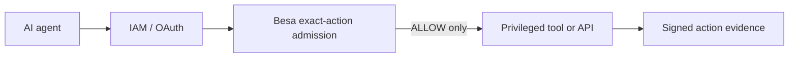

# Besa vs IAM

IAM and Besa answer different authorization questions.

| Layer | Primary question | Typical artifact |
|---|---|---|
| IAM / OAuth / workload identity | Who may authenticate and access a service or resource class? | Identity, role, token, cloud policy |
| Besa | May this exact consequential action execute under this exact contract? | Action Envelope, signed Action Capability, signed Action Evidence |

## Where Besa sits



Besa consumes identity and authority context established elsewhere. It does not
issue cloud credentials, authenticate workloads, evaluate an AWS IAM policy, or
replace least-privilege roles.

## Concrete boundary

An automation agent has valid AWS credentials and a role that can call a cloud
change service. Its signed Besa contract permits:

```text
agent:      agent:deploy-agent
operation:  deploy
resource:   environment:staging
commit:     abc123
expiry:     2026-09-23T19:00:00Z
```

The same authenticated agent requests:

```text
operation:  delete
resource:   database:production-db
```

IAM can correctly accept the identity and still leave the application with a
business-level authorization decision. Besa rejects this invocation because it
does not match the signed action contract. The protected handler is not called.

## What Besa adds

- A canonical hash for one proposed action, including resource and constraints.
- A signed allow or deny decision bound to that action, expiry, and nonce.
- Optional narrowing delegation between an authority and an agent.
- Replay consumption at the execution boundary when backed by an enforced
  replay store.
- Signed evidence linking the admitted action and supplied execution result.

These properties matter when authorization must cross identity providers,
agent frameworks, tools, or organizational boundaries and remain independently
verifiable afterward.

## When IAM is enough

Do not add Besa merely to duplicate a precise native policy. IAM or a cloud
provider's own authorization may be sufficient when it already binds every
relevant operation, resource, condition, expiry, and one-time-use requirement,
and no portable cryptographic evidence contract is needed.

Besa is not a claim that native cloud controls are weak. It is an additional,
provider-neutral execution contract for boundaries that need that portability.

See [Architecture](../ARCHITECTURE.md), [Threat Model](THREAT_MODEL.md), and
[Runtime Admission](RUNTIME_ADMISSION.md).
