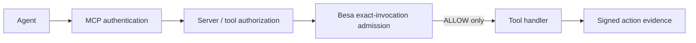

# Besa vs MCP authentication and authorization

MCP authentication and Besa are complementary boundaries.

| Layer | Primary question |
|---|---|
| MCP transport authentication | Which client or identity connected? |
| MCP server authorization | May that identity reach this server or tool? |
| Besa | May this exact invocation, with these arguments and constraints, execute now? |

MCP implementations can enforce detailed application policy. Besa does not
claim that MCP authorization is inherently coarse. It supplies a portable,
signed contract and evidence format when exact invocation admission must be
verified across systems or retained independently of one server's logs.

## Execution order



`withBesaMcp` belongs after normal MCP authentication and immediately before
the consequence-bearing handler. It checks that:

- the Action Envelope's `tool` equals the MCP call name;
- `requestHash` equals the canonical hash of the actual MCP arguments;
- the signed capability authorizes the same action hash, principal, agent,
  operation, resource, constraints, expiry, and nonce;
- configured delegation and replay requirements hold before execution.

## Concrete boundary

An authenticated client is allowed to call `aws.change`. Its Besa contract
permits `deploy` on `environment:staging` for commit `abc123`. The client sends:

```json
{
  "name": "aws.change",
  "arguments": {
    "operation": "delete",
    "resource": "database:production-db"
  }
}
```

Transport authentication can succeed and the tool can be discoverable while
Besa still denies this exact invocation. Changing the arguments also changes
the request hash, so a capability for one call cannot authorize another.

## What Besa does not do

Besa does not provide MCP discovery, routing, transport security, sessions,
client identity, consent, or server-wide access control. It does not inspect
prompts or judge model intent. The application remains responsible for mapping
each consequential MCP call to a complete, accurate Action Envelope.

## When MCP controls are enough

Use the MCP server's own authorization when it already binds all material call
arguments, resource conditions, expiry, delegation, and replay semantics and
when portable signed evidence is unnecessary. Adding a second check without an
independent trust or evidence requirement only adds complexity.

See the [MCP reference adapter](../examples/consequential-mcp-middleware.ts),
[Runtime Admission](RUNTIME_ADMISSION.md), and [Threat Model](THREAT_MODEL.md).
