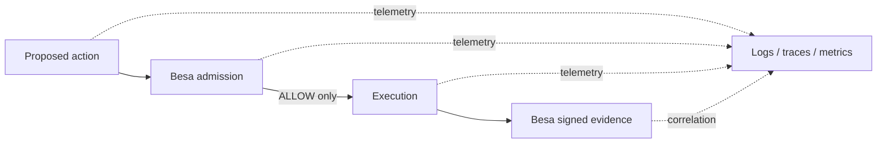

# Besa vs observability

Observability and Besa serve different parts of the execution lifecycle.

| Layer | Primary question | Typical output |
|---|---|---|
| Logs, traces, metrics, SIEM | What did the system report before, during, or after execution? | Events, spans, measurements, alerts |
| Besa | Was this exact action admitted under a signed contract, and is this supplied result linked to it? | Action Envelope, Action Capability, Action Evidence |

## Before and after execution

Observability can record rich context and detect suspicious behavior. It does
not by itself create a signed authorization bound to the exact action. Besa
does not replace telemetry, alerting, incident response, retention, or search.

## What Action Evidence proves

Given configured trust anchors and the matching artifacts, a verifier can check
that a trusted recorder signed:

- the exact Action Envelope hash;
- the signed allow capability used by the runtime;
- the supplied result hash and outcome metadata;
- the executor and recorder identifiers and timestamps.

This makes unauthorized artifact mutation detectable and lets another system
verify the links without trusting a private log format.

## What it does not prove

`ActionEvidenceV1` does not independently prove that AWS deleted a resource, a
bank settled a payment, or a database committed a mutation. It proves that the
configured recorder signed the supplied result. Real-world side-effect claims
are only as strong as the recorder's independence, placement, and key custody.

The JSONL evidence sink is append-only at the API boundary, not an immutable
ledger. Operators still need durable storage, access control, retention, backup,
and alerting appropriate to their environment.

## Use them together

Record the Besa action hash, capability ID, evidence ID, and reason code in the
surrounding trace or structured log. This provides operational search while the
signed artifacts provide a separately verifiable authorization chain. Avoid
putting secrets or unrestricted request bodies into either system.

See [Evidence Artifacts](EVIDENCE_ENVELOPE.md), [Threat Model](THREAT_MODEL.md),
and [Audit Scope](../AUDIT_SCOPE.md).
