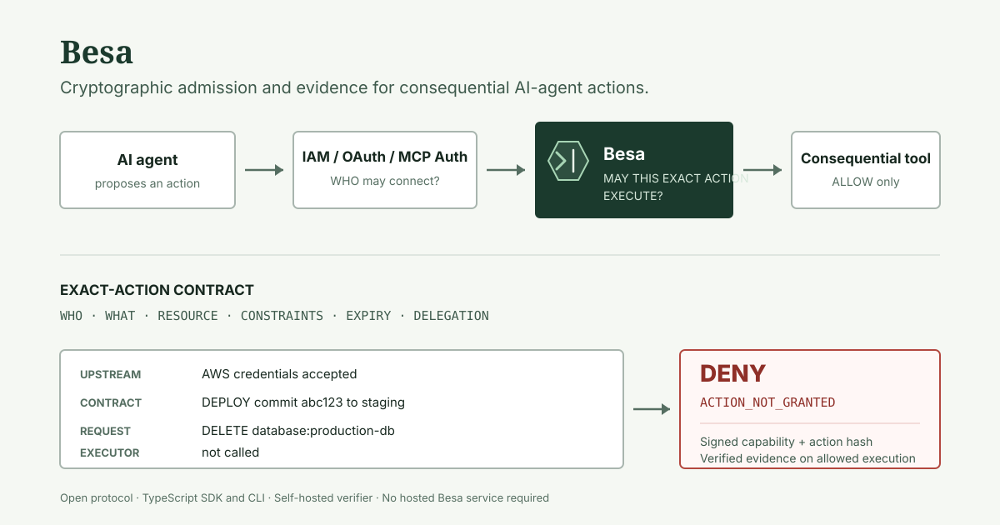

# Besa shareable media

Use technical evidence, not atmosphere. Besa media must show the execution
boundary, real terminal output, and explicit limitations.

## Canonical architecture image

Source: [`docs/assets/besa-architecture.svg`](../assets/besa-architecture.svg)

The image is a 1200 x 630 SVG with a solid background. It shows:

- Agent -> IAM / OAuth / MCP Auth -> Besa -> consequential tool.
- The six contract dimensions: who, what, resource, constraints, expiry, and
  delegation.
- Valid AWS credentials plus a denied `DELETE production-db` request.
- The protocol-correct `ACTION_NOT_GRANTED` reason and an uncalled executor.

Do not add customer logos, audit seals, partner marks, lock imagery, robot art,
or claims that evidence independently proves a real-world side effect.

## Terminal demo GIF

Record only after the next patch is publicly available from npm.

### Clean-room sequence

1. Create a new empty directory outside the repository.
2. Run `npm init -y`.
3. Run `npm install @dorigjo/besa@<published-patch>`.
4. Clear the terminal.
5. Start recording.
6. Type and run `npx besa demo`.
7. Stop after `evidence recorded: yes` appears.
8. Delete the temporary directory after verifying the capture.

### Capture specification

- Duration: 8–15 seconds.
- Canvas: 1200 x 630 or 1280 x 720.
- Terminal: 110–120 columns, high-contrast light or dark theme.
- Font: readable monospace at a size that survives mobile playback.
- Frame rate: 12–20 fps; avoid flashing cursor effects and fast cuts.
- Crop: terminal content only; no desktop, notifications, username, or local
  filesystem path.
- Loop: pause on the final verified evidence for at least two seconds.
- Output: optimized GIF under 5 MB plus an MP4/WebM alternative where supported.

The capture must show the actual random capability ID and real action hash from
that run. Do not replace them with designed values in the GIF.

## GitHub social preview

GitHub recommends 1280 x 640 pixels for best display and requires PNG, JPG, or
GIF under 1 MB. Use a solid background to avoid dark-mode surprises. See the
[official social-preview guidance](https://docs.github.com/en/repositories/managing-your-repositorys-settings-and-features/customizing-your-repository/customizing-your-repositorys-social-media-preview).

### Layout specification

- Size: 1280 x 640 PNG, under 1 MB.
- Background: `#F5F8F3`.
- Primary text: `Besa` and `Cryptographic admission for exact AI-agent actions`.
- Diagram: `Agent -> IAM / OAuth / MCP Auth -> Besa -> Action`.
- Proof line: `AWS access: accepted | DELETE production-db: denied`.
- Footer: `Open source · TypeScript · Self-hosted`.
- Safe area: keep all text at least 64 px from each edge.
- Minimum text size: 28 px for supporting copy, 52 px for the project name.

Do not put installation commands, badges, pricing, version numbers, or more
than one technical example in the social preview.

### Manual upload check

1. Export the SVG-based composition to PNG.
2. Inspect at full size and at 320 x 160.
3. Confirm every word remains readable and no arrow or label is clipped.
4. Upload in GitHub repository Settings -> Social preview.
5. Open a repository link preview in at least one light and one dark client.

The GitHub social preview is repository metadata and requires a maintainer with
settings access; committing the SVG does not update it automatically.

## Claim checklist

Before using any image or recording:

- `npx besa demo` succeeds from the published package version shown.
- The denial reason matches the actual policy evaluator.
- The denied executor was not called.
- The allow path uses a signed capability and verifies signed evidence.
- “No independent third-party security audit” remains true and visible in the
  linked repository.
- No traction number, customer, integration, or partnership is implied without
  public evidence.
